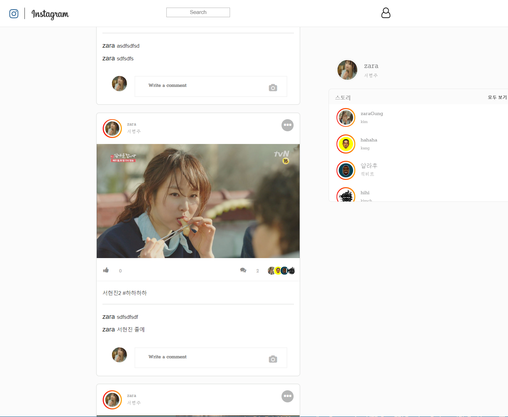

# 노드 js를 사용한 인스타그램 만들기
국비지원 교육을 받는 도중 메인 프로젝트와 별개로 시간이 남아 nodejs를 개별적으로 공부하던 중 인스타그램을 만들어 보고자 했다.
구글과 nodejs 책을 참고해가며 만들었다.
노드js의 대표적인 express 프레임워크를 사용했다.
 
   
## 사용한 모듈
express - nodejs의 대표적인 웹 개발 프레임 워크 
sequelize - mysql db의 orm 방식을 사용한 데이터베이스 모듈  
cookie-parser, body-parser - 클라이언트 요청에서 넘어오는 쿠키와 파라미터를 읽을 때 사용 
morgan - 콘솔 창에 로그를 출력해주는 모듈 
path - 경로를 쉽게 지정할 수 있도록 하는 모듈 
passport - 로그인 처리를 구현할 때 사용하는 모듈 
express-session - passport로 로그인 후 유저 정보를 세션에 저장하기 위해 사용하는 모듈 
connect-flash - 1회 성 메시지에 사용
    
## 잡담
평소 오라클 db를 사용하면서 처음 mysql 사용해보았는데 구현해보면서 익숙지 않은 orm 방식이라 어려운 부분도 있었지만 객체지향적으로 좀 더 상향된 기술이란 걸 
깨달았다. 어려운 점이 많았지만 많은 오류 처리와 새로운 방식을 도입하면서 실력이 늘었던 거 같다.

     

